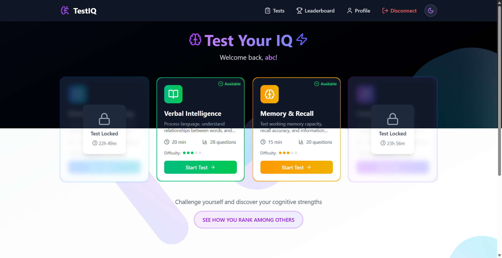

# 🧠 IQ Test Platform - Complete Project Overview

<div align="center">
  
  
  
  
  
  <p>
    <strong>A comprehensive cognitive assessment platform featuring advanced IQ testing capabilities, real-time scoring, global leaderboards, and stunning animations</strong>
  </p>

  <p>
    <a href="#-project-overview">Overview</a> •
    <a href="#-live-deployment">Live Demo</a> •
    <a href="#-architecture">Architecture</a> •
    <a href="#-features">Features</a> •
    <a href="#-technology-stack">Tech Stack</a> •
    <a href="#-deployment-strategy">Deployment</a>
  </p>
</div>

## 🎯 Project Overview

**IQ Test Platform** is a modern, full-stack web application designed to provide comprehensive cognitive assessments through four distinct test types. Built with cutting-edge technologies, the platform offers an engaging user experience with sophisticated animations, real-time scoring, and competitive leaderboards.

### 🌟 Core Mission

To democratize cognitive assessment by providing accessible, scientifically-designed IQ tests with immediate feedback and global performance comparisons.

### 🎯 Target Audience

- **Students** seeking to assess their cognitive abilities
- **Professionals** preparing for aptitude tests
- **Researchers** studying cognitive performance patterns
- **General Users** interested in intellectual challenges

## 🚀 Live Deployment

### 🌐 Production URLs

- **Frontend Application**: [https://iqtest-app.vercel.app](https://iqtest-app.vercel.app)
- **Backend API**: [https://iqtest-server-tkhl.onrender.com](https://iqtest-server-tkhl.onrender.com)
- **API Documentation**: [https://iqtest-server-tkhl.onrender.com/swagger](https://iqtest-server-tkhl.onrender.com/swagger)

### 📊 Live Statistics

- **Response Time**: < 2 seconds average
- **Uptime**: 99.9% target availability
- **Global CDN**: Vercel Edge Network for frontend
- **Server Regions**: US West Coast (Render)

## 🏗 Architecture Overview

### 🔄 System Architecture

```
┌─────────────────────┐    ┌─────────────────────┐    ┌─────────────────────┐
│                     │    │                     │    │                     │
│   Frontend (Next.js)│◄──►│  Backend (.NET API) │◄──►│  Database (SQL)     │
│   Vercel Edge       │    │   Render Cloud      │    │   Azure/Render      │
│                     │    │                     │    │                     │
└─────────────────────┘    └─────────────────────┘    └─────────────────────┘
          │                          │                          │
          │                          │                          │
          ▼                          ▼                          ▼
┌─────────────────────┐    ┌─────────────────────┐    ┌─────────────────────┐
│                     │    │                     │    │                     │
│   Global CDN        │    │  Redis Cache        │    │  Entity Framework   │
│   Edge Locations    │    │  Upstash Cloud      │    │  Migrations         │
│                     │    │                     │    │                     │
└─────────────────────┘    └─────────────────────┘    └─────────────────────┘
```

### 🔗 Communication Flow

1. **User Request**: Client interacts with React components
2. **API Call**: Frontend makes direct calls to .NET backend
3. **Authentication**: JWT validation with Redis session storage
4. **Data Processing**: Business logic execution with database queries
5. **Response**: JSON data returned with appropriate caching headers
6. **UI Update**: React state updates trigger animations and re-renders

### 🛡️ Security Architecture

```
┌─────────────────────┐
│   Security Layers   │
├─────────────────────┤
│ 1. HTTPS/TLS        │ ← Transport encryption
│ 2. CORS Protection  │ ← Cross-origin validation
│ 3. JWT Auth         │ ← Token-based authentication
│ 4. Rate Limiting    │ ← Request throttling
│ 5. Input Validation │ ← SQL injection prevention
│ 6. CSRF Protection  │ ← State change protection
└─────────────────────┘
```

## ✨ Features & Functionality

### 🧪 Core Testing Features

#### Test Types

| Type                    | Focus Area                              | Questions | Duration | Complexity |
| ----------------------- | --------------------------------------- | --------- | -------- | ---------- |
| **Numerical Reasoning** | Mathematical logic, pattern recognition | 20        | 25 min   | ⭐⭐⭐     |
| **Verbal Intelligence** | Language comprehension, analogies       | 20        | 30 min   | ⭐⭐⭐     |
| **Memory & Recall**     | Short-term memory, spatial recognition  | 15        | 22 min   | ⭐⭐⭐     |
| **Comprehensive IQ**    | Mixed cognitive abilities               | 16        | 45 min   | ⭐⭐⭐⭐⭐ |

#### Question Types

- **Multiple Choice**: Traditional A/B/C/D format with single selection
- **Fill-in-Gap**: Text input with pattern matching validation
- **Memory Pairs**: Interactive card matching with flip animations

#### Scoring System

- **Real-time Calculation**: Immediate scoring upon test completion
- **Percentile Rankings**: Performance comparison with global user base
- **Detailed Analytics**: Question-by-question performance breakdown
- **Historical Tracking**: Progress monitoring over time

### 👤 User Management

#### Authentication System

- **Secure Registration**: Username/password with country/age demographics
- **JWT-based Login**: 15-minute access tokens with refresh mechanism
- **Session Management**: Automatic token renewal and logout handling
- **Route Protection**: Private pages with automatic redirect

#### User Profiles

- **Personal Dashboard**: Test history and performance metrics
- **Demographic Data**: Optional country and age information
- **Privacy Controls**: GDPR-compliant data management
- **Account Settings**: Profile updates and preferences

### 🏆 Leaderboards & Analytics

#### Global Rankings

- **Overall Leaderboard**: Top performers across all test types
- **Test-specific Rankings**: Category-based performance leaders
- **Country Comparisons**: Regional performance analysis
- **Percentile System**: Relative performance positioning

#### Performance Analytics

- **Score Trends**: Historical performance tracking
- **Strength Analysis**: Category-wise performance insights
- **Time Analytics**: Completion speed vs. accuracy correlation
- **Improvement Metrics**: Progress tracking over multiple attempts

### 🎨 User Experience Features

#### Animation System

- **Loading Animations**: Neural network themed loading screens
- **Page Transitions**: Smooth slide and fade animations
- **Interactive Elements**: Hover effects and micro-interactions
- **Test Selection**: Card animations with loading overlays
- **Progress Indicators**: Animated progress bars and timers

#### Responsive Design

- **Mobile Optimization**: Touch-friendly interfaces for smartphones
- **Tablet Support**: Optimized layouts for tablet devices
- **Desktop Experience**: Full-featured desktop interface
- **Cross-browser**: Compatible with modern browsers

#### Accessibility

- **Theme Support**: Light/dark mode with system preference detection
- **Keyboard Navigation**: Full keyboard accessibility
- **Screen Reader**: ARIA labels and semantic HTML
- **Color Contrast**: WCAG AA compliant color schemes

### 🛡️ Security & Performance

#### Security Measures

- **Data Encryption**: HTTPS/TLS for all communications
- **Password Security**: BCrypt hashing with salt
- **Rate Limiting**: Request throttling to prevent abuse
- **Input Validation**: Comprehensive sanitization and validation
- **CSRF Protection**: Anti-forgery token validation

#### Performance Optimizations

- **Caching Strategy**: Redis for session data and frequently accessed content
- **CDN Distribution**: Global content delivery via Vercel Edge
- **Code Splitting**: Automatic route-based JavaScript splitting
- **Image Optimization**: Next.js automatic image processing
- **Database Optimization**: Efficient queries with proper indexing

## 🛠 Technology Stack

### 🎨 Frontend Architecture

#### Core Framework

```typescript
// Next.js 15.3.1 with App Router
├── React 19              // Latest React with concurrent features
├── TypeScript/JSDoc      // Type safety and IntelliSense
├── TailwindCSS 4         // Utility-first styling
└── Framer Motion 12      // Advanced animations
```

#### Key Libraries

- **UI Components**: Custom-built with Tailwind CSS
- **Icons**: Lucide React for consistent iconography
- **Themes**: next-themes for dark/light mode switching
- **Forms**: React Hook Form for efficient form handling
- **State Management**: React Context with hooks

#### Development Tools

- **ESLint**: Code quality and consistency
- **Prettier**: Code formatting
- **PostCSS**: CSS processing and optimization
- **Hot Reload**: Instant development feedback

### ⚙️ Backend Architecture

#### Core Framework

```csharp
// ASP.NET Core 9.0
├── Entity Framework Core 9.0    // Object-relational mapping
├── SQL Server 2022              // Primary database
├── Redis (StackExchange)        // Caching and sessions
└── JWT Bearer Authentication    // Security tokens
```

#### Services & Middleware

- **Authentication Service**: JWT token management
- **Test Service**: Question generation and scoring
- **Leaderboard Service**: Ranking calculations
- **Profile Service**: User data management
- **Caching Service**: Redis-based performance optimization

#### Security Middleware

- **Error Handling**: Global exception management
- **Rate Limiting**: Request throttling
- **CORS Protection**: Cross-origin request security
- **Security Headers**: Comprehensive HTTP security

### 🗄️ Data Architecture

#### Database Design

```sql
-- Core Tables
Users              -- User accounts and authentication
TestTypes          -- Test category definitions
Questions          -- Question pool with metadata
Answers            -- User responses and scoring
TestResults        -- Completed test records
LeaderboardEntries -- Performance rankings
```

#### Caching Strategy

- **User Sessions**: Redis-based session storage
- **Question Pools**: Cached question sets for performance
- **Leaderboards**: Cached rankings with TTL
- **Authentication**: Token validation caching

### 🚀 Deployment Infrastructure

#### Frontend Hosting (Vercel)

```yaml
Platform: Vercel
Framework: Next.js
Runtime: Edge Runtime
CDN: Global edge network
Build: Automatic on Git push
Scaling: Automatic scaling
SSL: Free SSL certificates
```

#### Backend Hosting (Render)

```yaml
Platform: Render
Runtime: Docker containers
Database: Managed SQL Server
Cache: Upstash Redis
Scaling: Horizontal scaling
Health Checks: Automatic monitoring
SSL: Free SSL certificates
```

## 🚢 Deployment Strategy

### 🔄 Development Workflow

#### Version Control

```bash
# Git workflow with feature branches
main branch          # Production-ready code
├── develop          # Integration branch
├── feature/*        # Feature development
├── bugfix/*         # Bug fixes
└── hotfix/*         # Critical production fixes
```

#### CI/CD Pipeline

```yaml
# Automated deployment pipeline
1. Code Push → GitHub
2. Automatic Build → Vercel/Render
3. Testing → Automated tests
4. Deployment → Production
5. Monitoring → Health checks
```

### 🌐 Production Environment

#### Frontend Deployment (Vercel)

- **Build Command**: `npm run build`
- **Framework**: Next.js with automatic optimization
- **Edge Runtime**: Global performance via edge computing
- **Environment Variables**: Secure configuration management
- **Analytics**: Built-in performance monitoring

#### Backend Deployment (Render)

- **Build**: Docker container with .NET 9.0 runtime
- **Database**: Managed SQL Server with automated backups
- **Cache**: Upstash Redis for high-performance caching
- **Health Checks**: Automatic service monitoring
- **Scaling**: Auto-scaling based on traffic

### 📊 Monitoring & Analytics

#### Performance Monitoring

- **Frontend Metrics**: Vercel Analytics for Core Web Vitals
- **Backend Metrics**: Application performance monitoring
- **Database Performance**: Query optimization and indexing
- **Cache Performance**: Redis hit rates and response times

#### Error Tracking

- **Global Error Handling**: Comprehensive error capture
- **User-friendly Messages**: Graceful error presentation
- **Logging**: Structured logging for debugging
- **Alerting**: Automated notifications for critical issues

## 🔧 Development Setup

### 📋 Prerequisites

#### System Requirements

```bash
# Required
Node.js 20.x+        # Frontend development
.NET 9.0 SDK         # Backend development
SQL Server           # Database (LocalDB for development)
Git                  # Version control

# Optional
Docker               # Containerization
Redis                # Local caching (graceful fallback)
```

### 🚀 Quick Start Guide

#### 1. Repository Setup

```bash
# Clone the repository
git clone <repository-url>
cd iqtest

# Install frontend dependencies
cd iqtest
npm install

# Install backend dependencies
cd ../IqTest-server
dotnet restore
```

#### 2. Environment Configuration

```bash
# Frontend (.env.local)
NEXT_PUBLIC_DIRECT_BACKEND_URL=http://localhost:5164
NEXT_SERVER_API_URL=http://localhost:5164

# Backend (appsettings.Development.json)
{
  "ConnectionStrings": {
    "DefaultConnection": "Server=(localdb)\\mssqllocaldb;Database=IqTestDev;Trusted_Connection=True"
  },
  "Jwt": {
    "Key": "your-development-key-minimum-32-characters"
  }
}
```

#### 3. Database Setup

```bash
# Apply database migrations
cd IqTest-server
dotnet ef database update
```

#### 4. Run Development Servers

```bash
# Terminal 1: Backend
cd IqTest-server
dotnet run

# Terminal 2: Frontend
cd iqtest
npm run dev
```

#### 5. Access Applications

- **Frontend**: http://localhost:3000
- **Backend API**: http://localhost:5164
- **Swagger Docs**: http://localhost:5164/swagger

### 🧪 Testing Strategy

#### Frontend Testing

```bash
# Development testing
npm run dev
npm run lint
npm run build

# Browser testing with Lighthouse
# Performance auditing
# Accessibility validation
```

#### Backend Testing

```bash
# Unit testing
dotnet test

# Integration testing
dotnet test --filter Category=Integration

# API testing with Swagger
```

## 📈 Project Scope & Future Roadmap

### ✅ Current Capabilities

#### MVP Features (Completed)

- ✅ User registration and authentication
- ✅ Four comprehensive test types
- ✅ Real-time scoring and results
- ✅ Global leaderboards and rankings
- ✅ Responsive design with animations
- ✅ Dark/light theme support
- ✅ 24-hour test cooldowns
- ✅ User profiles and test history

#### Advanced Features (Completed)

- ✅ Server wake-up monitoring
- ✅ Advanced caching with Redis
- ✅ Comprehensive error handling
- ✅ Security middleware pipeline
- ✅ GDPR compliance features
- ✅ Performance optimizations
- ✅ Production deployment

### 🚧 Future Enhancements

#### Phase 1: Advanced Analytics

- 📊 Detailed performance analytics dashboard
- 📈 Progress tracking with visual charts
- 🎯 Personalized improvement recommendations
- 📱 Mobile app development (React Native)

#### Phase 2: Social Features

- 👥 Friend challenges and competitions
- 🏆 Achievement system and badges
- 💬 Community forums and discussions
- 📤 Social media integration for score sharing

#### Phase 3: AI Integration

- 🤖 Adaptive question difficulty based on performance
- 📚 Personalized learning recommendations
- 🧠 AI-powered cognitive assessment insights
- 🔮 Predictive analytics for performance trends

#### Phase 4: Enterprise Features

- 🏢 Organization dashboards for schools/companies
- 👨‍🏫 Instructor tools for class management
- 📋 Custom test creation and management
- 📊 Advanced reporting and analytics

### 🎯 Success Metrics

#### User Engagement

- **Target**: 10,000+ registered users in first year
- **Retention**: 60%+ monthly active user rate
- **Completion**: 80%+ test completion rate
- **Satisfaction**: 4.5+ average user rating

#### Technical Performance

- **Availability**: 99.9% uptime target
- **Response Time**: < 2 seconds average API response
- **Core Web Vitals**: All green scores on Lighthouse
- **Security**: Zero security incidents

## 📄 License & Contributions

### 📝 License

This project is [MIT](../LICENSE) licensed, allowing for:

- ✅ Commercial use
- ✅ Modification and distribution
- ✅ Private use
- ✅ Patent use (with limitations)

### 🤝 Contributing Guidelines

While this is currently a personal project, future contributions may be welcomed through:

- 🐛 Bug reports via GitHub issues
- 💡 Feature requests and suggestions
- 🔧 Code contributions via pull requests
- 📖 Documentation improvements

### 🙏 Acknowledgments

Special thanks to:

- **Claude Code** for development assistance and guidance
- **Open Source Community** for the amazing tools and libraries
- **Vercel & Render** for excellent hosting platforms
- **Microsoft & Vercel Teams** for .NET and Next.js frameworks

---

<div align="center">
  <h3>🧠 Cognitive Assessment Made Accessible</h3>
  <p>
    <strong>A modern platform combining scientific rigor with exceptional user experience</strong>
  </p>
  
  <p>
    <a href="https://iqtest-app.vercel.app">🌐 Live Application</a> •
    <a href="../iqtest/README.md">📱 Frontend Docs</a> •
    <a href="../IqTest-server/README.md">⚙️ Backend Docs</a> •
    <a href="https://iqtest-server-tkhl.onrender.com/swagger">📚 API Docs</a>
  </p>
  
  <p>
    
    
    
  </p>
</div>
